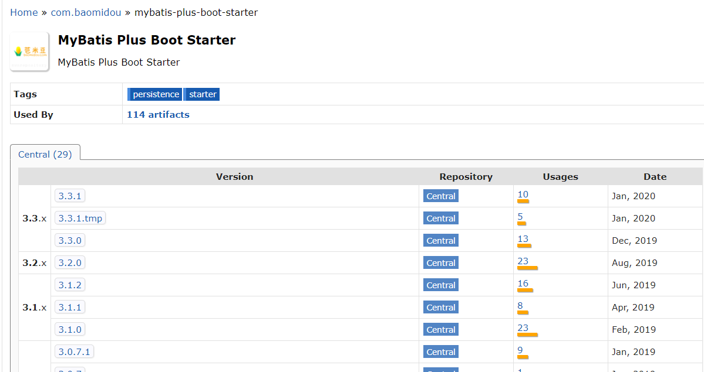
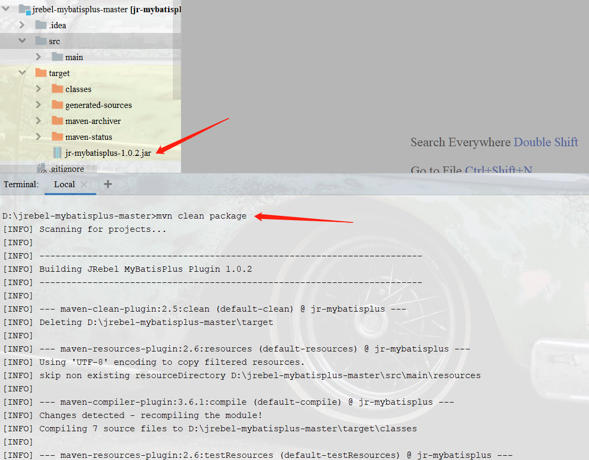
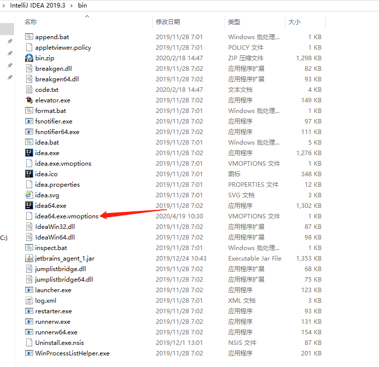
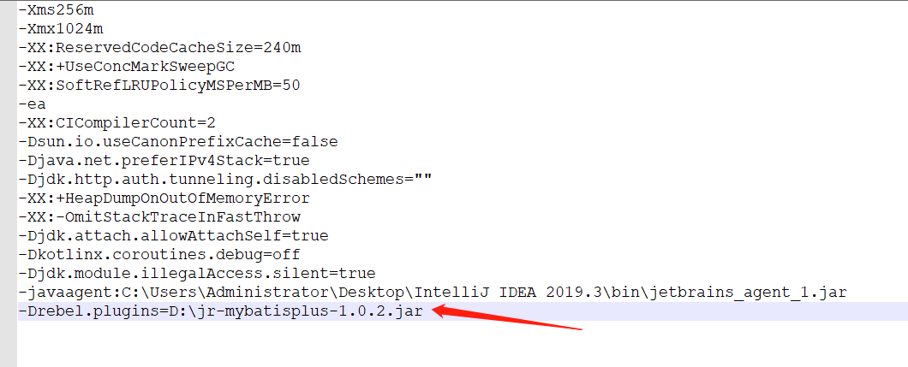
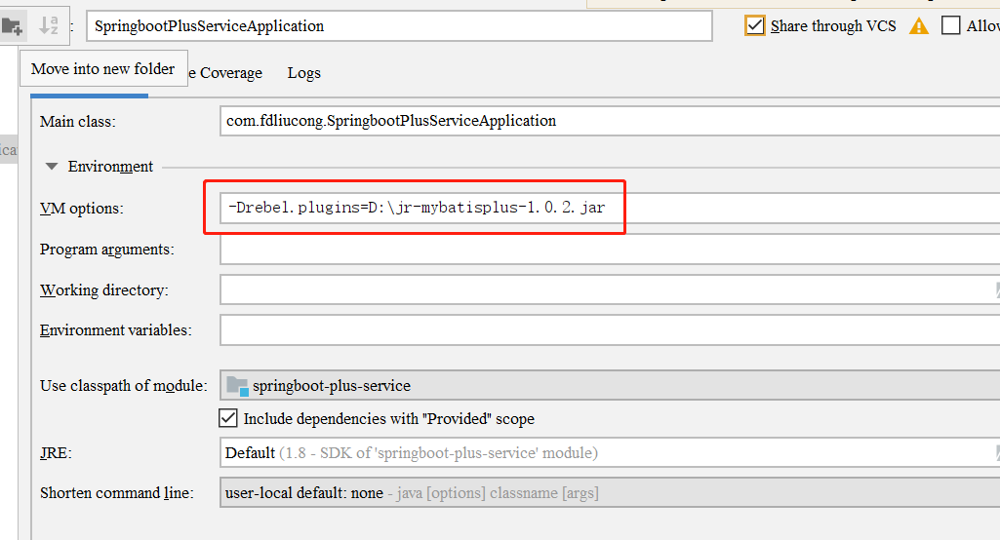

Mybatis-plus配置

首先官网：https://mp.baomidou.com/guide/hot-loading.html 已经明确表示 3.0.6版本上移除了该功能,不过最新快照版已加回来并打上废弃标识,3.1.0版本上已完全移除,如下图所示 本人接下来使用3.1.0版本进行配置，这里为什么不使用3.1.0以后版本呢，稍候就我自己的原因解释一下，各位个自行选择 3.1.0之后的版本

因为是springboot项目，因此选择mybatis-plus-boot-starter

    <!-- https://mvnrepository.com/artifact/com.baomidou/mybatis-plus-boot-starter -->
            <dependency>
                <groupId>com.baomidou</groupId>
                <artifactId>mybatis-plus-boot-starter</artifactId>
                <version>3.1.0</version>
            </dependency>

在gitHub上下载bel-mybatisplus插件到本地用idea打开并执行mvn clean package进行打包，如下图所示

插件源码地址：https://github.com/SweetInk/jrebel-mybatisplus

如上图所示打包完成之后target文件夹会出现一个jar包，将这个包复制出来放在任意文件夹下 比如：D:\jr-mybatisplus-1.0.2.jar

然后进入idea的安装文件夹下面的bin目录,比如：C:\Users\Administrator\Desktop\IntelliJ IDEA 2019.3\bin 找到以下文件，打开并加上：-Drebel.plugins=D:\jr-mybatisplus-1.0.2.jar 如下图所示

也可以直接在idea中设置VM参数，如下图所示，这样做的话那就每个项目都要配置，所以不建议在IDEA中配置

